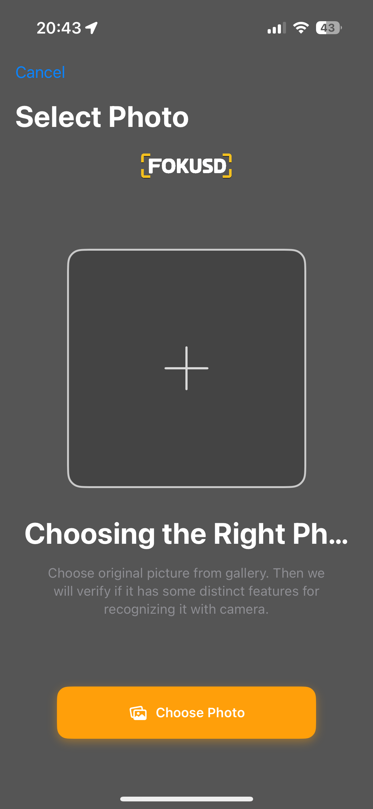

# Fokusd-showcase
# 🎯 Fokusd - Smart Focus & Distraction Blocker

> **🚧 Project Status:** Currently in active development and beta testing

**Fokusd** is an iOS application that combines **ARKit computer vision**, Apple's **Family Controls framework**, and **3D graphics with AR animations** to help users manage digital distractions. The app requires users to scan a physical photo using AR to unlock restricted applications, introducing deliberate, mindful actions to prevent reflexive app usage.

---

## 📸 Screenshots & User Interface

### 🏠 **Home Dashboard**

> *Main screen presenting restriction status and session management.*


*Clean and intuitive dashboard displaying session timer and quick access controls.*

### 📷 **AR Photo Scanning**

> *ARKit integration with real-time 3D visual feedback.*

<video src='https://github.com/user-attachments/assets/fa80a8aa-12f1-43f6-8daa-11b9908e5493' /></video>
*Users must actively scan their chosen physical image, promoting mindful unlocking.*

### 🖼️ **Photo Selection (Placeholder Design)**

> *Initial setup screen for selecting the user's physical unlock photo.*


*Note: Current placeholder design, subject to upcoming UX/UI improvements.*

### 📱 **App Selection Interface**

> *Granular app blocking via integrated Family Controls.*

<video src='https://github.com/user-attachments/assets/c3661184-a66a-4715-93b9-d5132ee6bce6' /></video>
*Seamless and precise selection of apps to block during focused sessions.*

### 🚀 **Onboarding Experience**

> *Guided setup with custom animations and AR tutorials.*

<video src='https://github.com/user-attachments/assets/dd4e32c6-4cec-46d6-b40a-903285099805' /></video>
*Walkthrough to familiarize users with the app concept.*

### ⚙️ **Settings & Configuration**

> *Flexible options with standard and restricted modes.*

* **Normal Settings Mode:**
<video src='https://github.com/user-attachments/assets/32909e55-4d44-4ca0-9318-79e3d1d44ccb' /></video>
  *Accessible customization options for regular adjustments.*

* **Restricted Settings Mode:**
<video src='https://github.com/user-attachments/assets/37aafadf-3eb3-49f7-83a3-0aa7678f5b30' /></video>
  *Tamper-lock protections preventing session interruptions.*

### 📊 **Analytics Dashboard (coming soon)**

> *Future integration: Detailed session tracking and analytics on usage patterns.*

---

**Note:**
This repository showcases the Fokusd app through descriptive documentation, screenshots, and demo animations. Codebase is private due to ongoing development and proprietary considerations.

---

## 🏗️ Architecture & Technical Implementation

### **Modular Architecture**
The app uses a modular Swift Package Manager (SPM) design with clear separation of concerns:

```
📦 Fokusd/
├── 🎯 Apps/Main/                    # Main application target
├── 📚 Packages/Sources/             # Feature modules
│   ├── 🏠 HomeFeature/             # Main dashboard & UI
│   ├── 🔒 RestrictionsModule/      # Family Controls integration
│   ├── 📷 ScanningModule/          # AR photo recognition
│   ├── ⚙️ SettingsFeature/         # Configuration & management
│   ├── 🚀 OnboardingFeature/       # User introduction flow
│   ├── 💾 PersistenceModule/       # SwiftData integration
│   ├── 🧩 CoreModule/              # Shared utilities & protocols
│   └── 🧪 TestSupport/             # Testing infrastructure & mocks
└── 🔧 Development Tools/           # Linting, formatting, pre-commit hooks
```

### **Development Tools & Quality Assurance**

#### **Code Generation & Automation**
- **Sourcery** - Automated mock generation for testing protocols
- **SwiftFormat** - Consistent code formatting across all modules
- **SwiftLint** - Code style enforcement and best practices
- **Pre-commit hooks** - Automated quality checks before commits

#### **Testing Framework**
- **Quick/Nimble** - BDD testing with readable specifications
- **Snapshot Testing** - UI regression prevention  
- **ViewInspector** - SwiftUI component testing
- **Protocol Mocks** - Generated test doubles for dependency injection

### **Architecture Patterns**
- **MVVM Pattern** - Clear separation between UI and business logic
- **Protocol-Oriented Design** - Dependency injection and testability
- **Observable State Management** - Modern `@Observable` macro usage
- **Modular Components** - Independent, reusable feature modules

---

## 📱 Key Features & Implementation

### **🔒 App Restrictions**
- **Family Controls Integration**: System-level app blocking using Apple's framework
- **Tamper-Lock Protection**: Prevents circumvention during active sessions
- **Strict Mode**: Enhanced security preventing app deletion or modification
- **Granular Control**: Custom app selection with category-based restrictions

### **📷 AR Technology**
- **ARKit Computer Vision**: User uploaded image recognition and tracking
- **3D Graphics & Animations**: Real-time visual feedback during scanning
- **Physical Photo Verification**: Real-world object scanning
- **Multi-Photo Support**: Register multiple unlock photos with AR reference data
- **Real-Time Processing**: Sub-second recognition with confidence scoring

### **🎨 3D Graphics & AR Animations**
- **Custom AR Overlays**: Dynamic 3D graphics responding to camera input
- **Smooth Transitions**: Fluid animations between scanning states
- **Visual Feedback**: Real-time 3D indicators for recognition progress

### **📊 Session Management**
- **Real-Time Tracking**: Session monitoring with precise timing
- **Emergency System**: Limited emergency unlocks (3 uses) with audit trail
- **Persistent Storage**: Reliable data persistence using SwiftData

---

## 🛠️ Technical Implementation

### **Core Technologies**

#### **🎯 AR Implementation**
- **ARKit Framework**: Computer vision capabilities for image recognition
- **3D Scene Rendering**: Custom SceneKit integration for AR overlays
- **Real-Time Processing**: Efficient image recognition with sub-second response
- **Reference Image Management**: AR anchor system for photo verification

#### **🔒 Family Controls Integration**
- **ManagedSettings Framework**: System-level restriction enforcement
- **Shield Configuration**: App blocking with custom interfaces
- **Authorization Handling**: Permission management
- **Tamper Resistance**: Multi-layer protection against circumvention

#### **💾 Data Architecture**
- **SwiftData Integration**: Core Data replacement for persistence
- **Observable Pattern**: Modern state management with `@Observable` macro
- **Async/Await**: Modern concurrency patterns
- **Protocol-Oriented Design**: Testable, modular architecture

### **📱 Platform Integration**
- **iOS 17.0+**: Latest platform features and optimizations
- **Swift 5.9+**: Modern language features and performance
- **SwiftUI**: Declarative UI with advanced animations
- **UIKit**: Custom components where needed
- **Combine Framework**: Reactive programming for complex state management

---

## 🧪 Testing Strategy

### **Testing with Quick/Nimble**
```swift
describe("HomeViewModel") {
    var viewModel: HomeViewModel!
    var restrictionsManagerMock: AppRestrictionProtocolMock!
    
    beforeEach {
        restrictionsManagerMock = AppRestrictionProtocolMock()
        viewModel = HomeViewModel(restrictionsManager: restrictionsManagerMock)
    }
    
    describe("initial state") {
        it("should be in initial state") {
            expect(viewModel.state).to(be(.initial))
        }
    }
    
    describe("when onAppear event is triggered") {
        context("when restrictions manager returns valid data") {
            beforeEach {
                restrictionsManagerMock.isAuthorized = true
                restrictionsManagerMock.isRestrictionEnabled = false
            }
            
            it("should load the current state") {
                waitUntil(timeout: .seconds(1)) { done in
                    viewModel.trigger(.onAppear)
                    
                    DispatchQueue.main.asyncAfter(deadline: .now() + 0.5) {
                        expect(viewModel.state).to(be(.loaded(
                            isRestrictionEnabled: false,
                            isAuthorized: true,
                            selection: selection
                        )))
                        done()
                    }
                }
            }
        }
    }
}
```

### **Test Coverage**
- **Unit Tests**: Individual components in isolation using protocol mocks
- **Integration Tests**: Feature interactions and data flow
- **UI Tests**: Critical user flows and interface validation
- **Snapshot Tests**: UI regression prevention

---

## ✨ Technical Highlights

### **🎯 AR Security System**
```swift
// AR reference image processing with 3D feedback
func processARRecognition(anchor: ARImageAnchor) {
    let recognitionConfidence = anchor.estimatedViewingAngle
    render3DSuccessIndicator(at: anchor.transform)
    triggerHapticFeedback(.success)
}
```

### **🔒 Tamper-Resistant Restrictions**
```swift
// Multi-layer protection with Family Controls
private func applyRestrictionsWithTamperLock() {
    store.shield.applications = selectedApps
    tamperLockStore.application.denyAppRemoval = true
    recordSecurityEvent(.restrictionsEnabled)
}
```

### **🎨 3D AR Animations**
```swift
// Dynamic 3D graphics responding to AR state
func animate3DRecognitionFeedback() {
    let pulseAnimation = CABasicAnimation(keyPath: "transform.scale")
    arOverlayNode.addAnimation(pulseAnimation, forKey: "recognition")
}
```

---

## 🎯 Technical Achievements

### **🚀 Key Features**
1. **AR-Based Security**: Physical photo verification system using computer vision
2. **3D Visual Feedback**: Real-time graphics during AR scanning
3. **Anti-Circumvention Design**: Multiple protection layers against common bypasses
4. **Family Controls Integration**: Deep system-level restriction capabilities

### **⚡ Performance & Optimization**
- **Real-Time AR Processing**: Sub-second image recognition
- **Memory Efficiency**: Optimized 3D rendering for extended AR sessions
- **Battery Management**: Power-efficient AR scanning with smart state management
- **Smooth Animations**: 60fps AR graphics with fluid transitions

### **🔐 Security Architecture**
- **Multi-Factor Protection**: AR + Family Controls + Tamper Lock
- **Audit Trail**: Comprehensive logging of all security events
- **Emergency Protocols**: Fail-safe mechanisms with limited override access
- **Privacy-First**: Local processing with no data transmission

---

## 🏆 Technical Implementation Highlights

This project demonstrates:

- **🎯 Complex Framework Integration**: Coordination of ARKit, Family Controls, and SwiftData
- **🎨 Advanced 3D Graphics**: Custom AR overlays with real-time animations
- **🔒 Security Design**: Anti-circumvention techniques and tamper resistance
- **📱 Modern iOS Development**: Latest Swift/SwiftUI patterns and best practices
- **⚡ Performance Engineering**: Optimized for real-time AR and graphics processing
- **🧪 Comprehensive Testing**: BDD testing with automated mock generation

---

## 📄 Project Information

**Status**: Active development and beta testing  
**Platform**: iOS 17.0+ (iPhone)  
**Architecture**: Modular Swift Package Manager design  
**Frameworks**: ARKit, Family Controls, SwiftData, SwiftUI, UIKit  
**Development Tools**: Sourcery, SwiftFormat, SwiftLint, Quick/Nimble

This repository serves as a **technical showcase** demonstrating advanced iOS development capabilities and approaches to digital wellness challenges.

---

> **For Recruiters & Technical Evaluators**: This project showcases modern iOS development with complex framework integration, advanced AR/3D graphics implementation, and comprehensive testing strategies. The technical architecture demonstrates expertise in Swift development, Apple platform integration, and production-quality mobile application engineering. 
