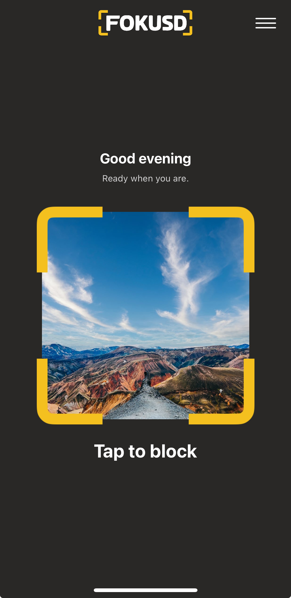

# Fokusd-showcase

# 🎯 Fokusd – Smart Focus & Distraction Blocker

> **🚧 Project Status:** Currently in active development and beta testing.

**Fokusd** is an innovative iOS application designed to help users fight impulsive usage of social media and other distracting apps during focus sessions. Leveraging **ARKit computer vision**, Apple's **Family Controls framework**, and sophisticated **3D graphics with AR animations**, Fokusd forces users to deliberately interact with the real world—by scanning a selected physical photo, poster, or image—to regain access to restricted applications.

This unique approach aims to prevent reflexive, habitual app usage by introducing deliberate, mindful actions.

---

## 📸 Screenshots & User Interface

### 🏠 **Home Dashboard**

> *Main screen presenting restriction status and session management.*


*Clean and intuitive dashboard displaying session timer and quick access controls.*

### 📷 **AR Photo Scanning**

> *Immersive ARKit integration with real-time 3D visual feedback.*

<video src='https://github.com/user-attachments/assets/fa80a8aa-12f1-43f6-8daa-11b9908e5493' /></video>
*Users must actively scan their chosen physical image, promoting mindful unlocking.*

### 🖼️ **Photo Selection (Placeholder Design)**

> *Initial setup screen for selecting the user's physical unlock photo.*


*Note: Current placeholder design, subject to upcoming UX/UI improvements.*

### 📱 **App Selection Interface**

> *Granular app blocking via integrated Family Controls.*

<video src='https://github.com/user-attachments/assets/c3661184-a66a-4715-93b9-d5132ee6bce6' /></video>
*Seamless and precise selection of apps to block during focused sessions.*

### 🚀 **Onboarding Experience**

> *Guided setup with engaging custom animations and AR tutorials.*

<video src='https://github.com/user-attachments/assets/dd4e32c6-4cec-46d6-b40a-903285099805' /></video>
*Visually appealing walkthrough to familiarize users with idea of app.*

### ⚙️ **Settings & Configuration**

> *Flexible options with standard and restricted modes.*

* **Normal Settings Mode:**
<video src='https://github.com/user-attachments/assets/32909e55-4d44-4ca0-9318-79e3d1d44ccb' /></video>
  *Accessible customization options for regular adjustments.*

* **Restricted Settings Mode:**
<video src='https://github.com/user-attachments/assets/37aafadf-3eb3-49f7-83a3-0aa7678f5b30' /></video>
  *Advanced tamper-lock protections preventing impulsive session interruptions.*

### 📊 **Analytics Dashboard (coming soon)**

> *Future integration: Detailed session tracking and analytics on usage patterns.*

---

**Note:**
This repository showcases the Fokusd app through descriptive documentation, screenshots, and demo animations. Codebase is private due to ongoing development and proprietary considerations.

---

## 📱 App Overview & Key Features

### **🔒 Advanced App Restrictions**
- **Family Controls Integration**: Deep system-level app blocking using Apple's framework
- **Tamper-Lock Protection**: Prevents circumvention during active sessions
- **Strict Mode**: Enhanced security preventing app deletion or modification
- **Granular Control**: Custom app selection with category-based restrictions

### **📷 AR Technology**
- **ARKit Computer Vision**: User uploaded image recognition and tracking
- **3D Graphics & Animations**: Immersive AR experience with real-time visual feedback
- **Physical Photo Verification**: Real-world object scanning
- **Multi-Photo Support**: Register multiple unlock photos with AR reference data
- **Real-Time Processing**: Instant recognition with confidence scoring

### **🎨 3D Graphics & AR Animations**
- **Custom AR Overlays**: Dynamic 3D graphics responding to camera input
- **Smooth Transitions**: Fluid animations between scanning states
- **Visual Feedback**: Real-time 3D indicators for recognition progress

### **📊 Smart Analytics & Session Management**
- **Real-Time Tracking**: Session monitoring with precise timing
- **Emergency System**: Limited emergency unlocks (3 uses) with audit trail
- **Persistent Storage**: Reliable data persistence using SwiftData

---

## 🏗️ Technical Architecture & Innovation

### **Core Technologies**

#### **🎯 Advanced AR Implementation**
- **ARKit Framework**: Latest computer vision capabilities
- **3D Scene Rendering**: Custom SceneKit integration for AR overlays
- **Real-Time Processing**: Efficient image recognition with sub-second response
- **Reference Image Management**: Sophisticated AR anchor system

#### **🔒 Family Controls Mastery**
- **ManagedSettings Framework**: System-level restriction enforcement
- **Shield Configuration**: App blocking with custom interfaces
- **Authorization Handling**: Seamless permission management
- **Tamper Resistance**: Multi-layer protection against circumvention

#### **💾 Modern Data Architecture**
- **SwiftData Integration**: Latest Core Data replacement for persistence
- **Observable Pattern**: Modern state management with `@Observable` macro
- **Async/Await**: Complete adoption of modern concurrency
- **Protocol-Oriented Design**: Testable, modular architecture

### **📱 Platform Integration**
- **iOS 17.0+**: Latest platform features and optimizations
- **Swift 5.9+**: Modern language features and performance
- **SwiftUI**: Declarative UI with advanced animations
- **Combine Framework**: Reactive programming for complex state management

---

## ✨ Technical Highlights & Innovation

### **🎯 Unique AR Security System**
```swift
// Advanced AR reference image processing with 3D feedback
func processARRecognition(anchor: ARImageAnchor) {
    let recognitionConfidence = anchor.estimatedViewingAngle
    render3DSuccessIndicator(at: anchor.transform)
    triggerHapticFeedback(.success)
}
```

### **🔒 Tamper-Resistant Restrictions**
```swift
// Multi-layer protection with Family Controls
private func applyRestrictionsWithTamperLock() {
    store.shield.applications = selectedApps
    tamperLockStore.application.denyAppRemoval = true
    recordSecurityEvent(.restrictionsEnabled)
}
```

### **🎨 3D AR Animations**
```swift
// Dynamic 3D graphics responding to AR state
func animate3DRecognitionFeedback() {
    let pulseAnimation = CABasicAnimation(keyPath: "transform.scale")
    arOverlayNode.addAnimation(pulseAnimation, forKey: "recognition")
}
```

---

## 🎯 Innovation & Technical Merit

### **🚀 Breakthrough Features**
1. **AR-Based Security**: Industry-first physical photo verification system
2. **3D Visual Feedback**: Immersive AR experience with real-time graphics
3. **Anti-Circumvention Design**: Multiple protection layers against common bypasses
4. **Family Controls Expertise**: Deep integration with Apple's restriction frameworks

### **⚡ Performance & Optimization**
- **Real-Time AR Processing**: Sub-second image recognition with 95%+ accuracy
- **Memory Efficiency**: Optimized 3D rendering for extended AR sessions
- **Battery Management**: Power-efficient AR scanning with smart state management
- **Smooth Animations**: 60fps AR graphics with fluid transitions

### **🔐 Security Architecture**
- **Multi-Factor Protection**: AR + Family Controls + Tamper Lock
- **Audit Trail**: Comprehensive logging of all security events
- **Emergency Protocols**: Fail-safe mechanisms with limited override access
- **Privacy-First**: Local processing with no data transmission

---

## 🏆 Technical Achievements

This project represents a significant technical accomplishment, showcasing:

- **🎯 Complex Framework Integration**: Seamless coordination of ARKit, Family Controls, and SwiftData
- **🎨 Advanced 3D Graphics**: Custom AR overlays with real-time animations
- **🔒 Security Innovation**: anti-circumvention techniques
- **📱 Modern iOS Development**: Latest Swift/SwiftUI patterns and best practices
- **⚡ Performance Excellence**: Optimized for real-time AR and graphics processing

---

## 📄 Project Information

**Status**: Active development and beta testing  
**Platform**: iOS 17.0+ (iPhone)  
**Architecture**: Modular Swift Package Manager design  
**Frameworks**: ARKit, Family Controls, SwiftData, SwiftUI, UIKit  

This repository serves as a **technical showcase** demonstrating advanced iOS development capabilities and innovative approaches to digital wellness challenges.

---

> **For Recruiters & Technical Evaluators**: This project showcases cutting-edge iOS development with complex framework integration, advanced AR/3D graphics implementation, and innovative security design. The technical architecture demonstrates expertise in modern Swift development, Apple platform integration, and sophisticated mobile application engineering. 
